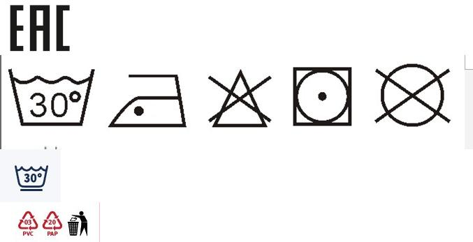

# Excel Image Exporter

Этот проект предоставляет функции для экспорта изображений, встроенных в Excel-файл, и объединения их в одно изображение. Работа с изображениями осуществляется через встроенные в Excel файлы, которые можно извлечь с помощью библиотеки `zipfile`. Для обработки и объединения изображений используется библиотека `Pillow`.

## Функциональность

1. **Извлечение изображений из Excel-файла**:
   - Функция `filter_images` фильтрует встроенные файлы Excel, извлекая только изображения форматов `.png`, `.jpg`, и `.jpeg`.
   - Извлечённые изображения сохраняются в виде байтовых данных.

2. **Объединение изображений**:
   - Извлечённые изображения объединяются в одно большое изображение, выравнивая их по вертикали.
   - Для создания единого изображения используется библиотека `Pillow`, которая позволяет сохранить результат в формате JPEG.

## Основные зависимости

- `zipfile`: стандартная библиотека Python для работы с ZIP-архивами (Excel-файлы в формате `.xlsx` фактически являются ZIP-архивами).
- `Pillow`: библиотека для работы с изображениями.

## Установка зависимостей

Перед использованием убедитесь, что установлены необходимые библиотеки. Для этого выполните следующую команду:

```bash
pip install Pillow
```

## Пример использования

### Шаг 1: Извлечение изображений из Excel-файла

```python
import zipfile


def filter_images(embedded_file: str) -> bool:
    embedded_file = embedded_file.lower()
    is_image = any(
        (
            embedded_file.endswith(".png"),
            embedded_file.endswith(".jpg"),
            embedded_file.endswith(".jpeg"),
        )
    )
    return is_image


file_path = "example.xlsx"
save_path = "example.png"

zip_file = zipfile.ZipFile(file_path)
image_files = filter(filter_images, zip_file.namelist())
opened_files = [zip_file.read(image) for image in image_files]
```

Этот код открывает Excel-файл, фильтрует встроенные изображения и загружает их в память.

### Шаг 2: Объединение изображений и сохранение результата

```python
import io
from PIL import Image


save_path = "example.jpg"
background_color = (255, 255, 255)

images = [Image.open(io.BytesIO(image_data)) for image_data in opened_files]
widths, heights = zip(*(image.size for image in images))
total_height = sum(heights)
max_width = max(widths)

save_image = Image.new("RGB", (max_width, total_height), background_color)

y_offset = 0
for image in images:
    save_image.paste(image, (0, y_offset))
    y_offset += image.height

save_image.save(save_path)
```


Этот код объединяет все изображения в одно и сохраняет его в формате JPEG.

## Примечания

- Код работает только с Excel-файлами формата `.xlsx`, так как они представляют собой ZIP-архивы.
- Изображения извлекаются в том порядке, в котором они хранятся в архиве Excel, что может не соответствовать их порядку в самом документе.
- Изображения объединяются по вертикали, но это поведение можно легко изменить, если необходимо, например, выравнивание по горизонтали.

## Лицензия

Этот проект распространяется под лицензией MIT. Подробности можно найти в файле [LICENSE](LICENSE).